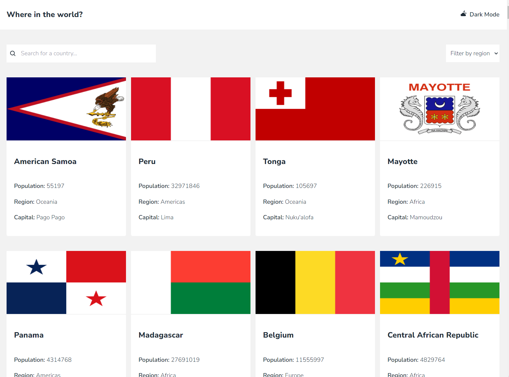

# Frontend Mentor - Results summary component solution

This is a solution to the [component challenge on Frontend Mentor](https://www.frontendmentor.io/challenges/rest-countries-api-with-color-theme-switcher-5cacc469fec04111f7b848ca). Frontend Mentor challenges help you improve your coding skills by building realistic projects.

## Table of contents

-   [Overview](#overview)
    -   [The challenge](#the-challenge)
    -   [Screenshot](#screenshot)
    -   [Links](#links)
-   [My process](#my-process)
    -   [Built with](#built-with)
    -   [What I learned](#what-i-learned)
    -   [Continued development](#continued-development)
    -   [Useful resources](#useful-resources)

## Overview

### The challenge

Users should be able to:

-   View the optimal layout for the interface depending on their device's screen size
-   See hover and focus states for all interactive elements on the page

### Screenshot

### Links

-   Solution URL:
-   Live Site URL: https://dlee1993.github.io/FEM-rest-api/

## My process

So the process for this challenge is actually quite straightforward, you make an api request, take the data array, map over that data to get the individual countries and then add that data to the jsx, you will also need to loop through objects and arrays in the individual data to get multiple values back, i.e. languages, currencies are objects in the individual data objects. And then add all values to the jsx

### Built with

-   Semantic HTML5 markup
-   Tailwindcss
-   React
-   Flexbox
-   Mobile-first workflow
-   [React](https://reactjs.org/) - JS library

### What I learned

This challenge is great for working with fetch requests and json data from an api, this also allowed me to work with multiple fetch request with different endpoints based on the page the user is on. I also practiced taking the response data and looping through the data array and the individual objects(countries) and taking specific key value pairs to add to the jsx. I used react router dom to help with adding params to the request to fetch the correct piece of data needed. I also used react icons for the icons.

### Continued development

I will continue to develop my skills in using api's, fetch and json data. I will also be improving my tailwindcss skills

### Useful resources

-   Tailwindcss Docs (https://www.tailwindcss.com)
-   React Icons (https://react-icons.github.io/react-icons/)

## Author

-   Frontend Mentor - https://www.frontendmentor.io/profile/DLee1993
